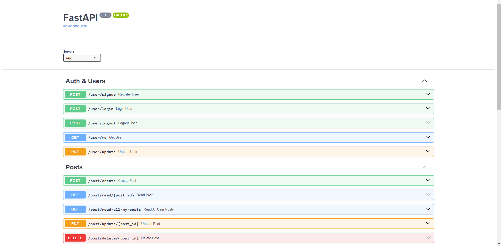

# Project Deployment Guide

## Prerequisites

- Python 3.12
- Docker

## Installation and Running Application Guide

1. **Clone the repository:**

    ```sh
    git clone https://github.com/pappper1/starnavi
    cd starnavi
    ```

2. **Create an .env:**

    ```sh
    touch .env
    ```
4. **Fill all information:**

    ```sh
    MODE options:
    - DEV
    - PROD
    ```

3. **Run Docker Compose file:**

     ```sh
     docker-compose up --build -d
     ```

4. **Access the application:**

    Open your web browser and go to `http://127.0.0.1/docs`.
   

## Running Tests

1. **Clone the repository:**

    ```sh
    git clone https://github.com/pappper1/starnavi
    cd starnavi
    ```

2. **Create an .env:**

    ```sh
    touch .env
    ```
4. **Fill all information:**

    ```sh
    MODE options:
    - TEST
    ```

3. **Run Docker Compose file:**

     ```sh
     docker-compose up --build
     ```

4. **Watch tests results:**

    In your console you can see tests results.

## Environment Variables

Ensure the following environment variables are set:

- `MODE`: Application mode (DEV, PROD, TEST)
- `LOG_LEVEL`: Logging level (DEBUG, INFO, WARNING, ERROR, CRITICAL)
- `DB_HOST`: Database host (equals db)
- `DB_PORT`: Database port (default 5432)
- `DB_NAME`: Database name (must be equal to POSTGRES_DB)
- `DB_USER`: Database user (must be equal to POSTGRES_USER)
- `DB_PASS`: Database password (must be equal to POSTGRES_PASSWORD)
- `POSTGRES_DB`: PostgreSQL configuration database name
- `POSTGRES_USER`: PostgreSQL configuration user
- `POSTGRES_PASSWORD`: PostgreSQL configuration password
- `TEST_DB_HOST`: Test database host (equals db)
- `TEST_DB_PORT`: Test database port (default 5432)
- `TEST_DB_NAME`: Test database name
- `TEST_DB_USER`: Test database user (must be equal to POSTGRES_USER)
- `TEST_DB_PASS`: Test database password (must be equal to POSTGRES_PASSWORD)
- `JWT_SECRET_KEY`: Randomly generated secret key
- `JWT_ALGORITHM`: Algorithm used for encoding and decoding JWT (HS256, HS384, HS512)
- `OPENAI_KEY`: OpenAI API key

## Additional Notes

- For any issues, contact the maintainer.